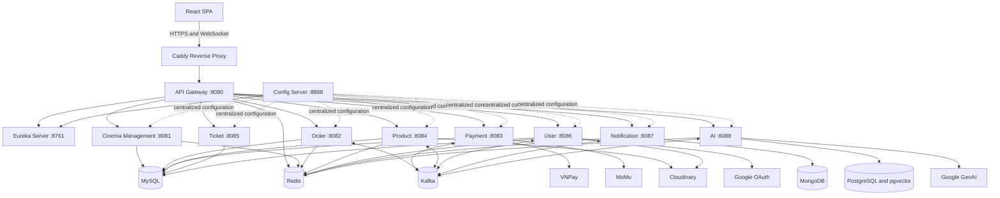

# Alpha Cinema - Movie Ticket Booking Platform

Alpha Cinema is a full-stack movie ticket booking platform built with a
microservices architecture. The project supports customer-facing cinema
experiences, employee operations, realtime seat updates, event-driven workflows,
and an AI-assisted cinema chatbot.

## Table of Contents

- [Overview](#overview)
- [Key Features](#key-features)
- [Tech Stack](#tech-stack)
- [System Architecture](#system-architecture)
- [Service Catalog](#service-catalog)
- [Project Structure](#project-structure)
- [Local Development](#local-development)
- [Environment Variables](#environment-variables)
- [Testing](#testing)
- [CI/CD and Deployment](#cicd-and-deployment)
- [Technical Notes](#technical-notes)

## Overview

Alpha Cinema provides a single platform for browsing movies, checking
showtimes, reserving seats, purchasing tickets and products, processing
payments, and managing cinema operations.

The application serves four user roles:

| Role | Main responsibilities |
| --- | --- |
| `CUSTOMER` | Browse movies and showtimes, book seats, purchase products, manage a profile, view orders, submit reviews, and receive notifications. |
| `ADMIN` | Manage cinema data, movies, artists, products, promotions, customers, employees, reviews, pricing, schedules, and AI policies. |
| `MANAGER` | Monitor a cinema branch and manage rooms, schedules, seats, seat types, staff, and orders. |
| `STAFF` | Sell tickets and products, view assigned workflows, and validate tickets. |

The backend is organized as a Maven multi-module project with infrastructure,
core domain, and support services. The frontend is a React single-page
application with role-aware routing.

## Key Features

### Authentication and Authorization

- JWT-based authentication with access-token refresh support.
- Customer registration, login, logout, profile retrieval, and password reset.
- Email OTP flows for password recovery and email updates.
- Google OAuth login for customers.
- Role-based frontend routes for customers, administrators, managers, and staff.
- Redis-backed token and OTP state.

### Movie Discovery and Cinema Operations

- Movie browsing with details, trailers, artists, genres, age ratings, and
  showtime discovery.
- Cinema, room, seat, and seat-type management.
- Movie, artist, schedule, ticket-price, holiday, product, and promotion
  management.
- Excel import support in the employee-facing frontend.
- Administrative, manager, and staff dashboard views.

### Booking, Orders, and Payments

- Seat layout lookup and seat selection for a showtime.
- Redis-backed seat locks and checkout sessions with a 10-minute TTL.
- Order history, order details, promotions, loyalty-point updates, and ticket
  check-in.
- Cinema product cart and checkout flows.
- Payment support for VNPay, MoMo, and cash transactions.
- QR-oriented ticket workflows for staff-side validation.

### Realtime and Event-Driven Workflows

- Kafka-based events for seat locks, successful orders, payment results,
  loyalty-point updates, OTP delivery, and review moderation.
- STOMP WebSocket endpoint at `/ws`.
- Realtime seat updates through `/topic/seat-locks/{showScheduleId}`.
- Customer notifications through `/topic/notifications/{customerId}`.
- MongoDB-backed notification persistence.

### AI Assistant and Review Moderation

- SSE-streamed chatbot responses through the AI service.
- Spring AI integration with Google GenAI chat and embedding models.
- PostgreSQL with pgvector for vector-store-backed knowledge retrieval.
- Redis chat memory and persisted chat conversation history.
- Policy knowledge for booking, payment, privacy, promotions, loyalty points,
  refunds, QR tickets, and movie reviews.
- Tool calling for movie search, showtimes, available seats, cinema branches,
  products, ticket prices, promotions, membership information, and customer
  orders.
- Kafka-driven AI review moderation.

### CI/CD and Deployment

- Path-filtered GitHub Actions workflows for each backend service and
  infrastructure component.
- Pull-request validation before code reaches `main`.
- Docker image build and push to Docker Hub after changes reach `main`.
- EC2 deployment over SSH with Docker Compose.
- Post-deployment smoke tests for application services, Eureka registration,
  the public API Gateway route, Redis, and Kafka.

## Tech Stack

### Frontend

| Area | Technologies |
| --- | --- |
| Framework | React 19, TypeScript, Vite |
| State and data fetching | Redux Toolkit, TanStack React Query, Axios |
| Routing | React Router |
| Styling and UI | Tailwind CSS, Radix UI, Lucide React |
| Realtime communication | STOMP over WebSocket |
| Additional capabilities | Google OAuth, XLSX import, QR rendering and scanning |

### Backend

| Area | Technologies |
| --- | --- |
| Runtime | Java 21 |
| Framework | Spring Boot 3.3, Spring Cloud |
| Service infrastructure | Spring Cloud Gateway, Netflix Eureka, Spring Cloud Config |
| Persistence | Spring Data JPA, Spring Data MongoDB, Spring Data Redis |
| Messaging | Apache Kafka, Spring Kafka |
| Resilience and communication | Resilience4j, WebClient, OpenFeign |
| AI | Spring AI, Google GenAI, Google embedding model, pgvector |
| Security and utilities | JWT, Bean Validation, Lombok, MapStruct |

### Data, Cloud, and DevOps

| Area | Technologies |
| --- | --- |
| Relational data | MySQL 8 for cinema, ticket, user, product, order, and payment domains |
| AI data | PostgreSQL 16 with pgvector |
| Notification data | MongoDB |
| Cache and ephemeral state | Redis |
| Message broker | Apache Kafka 4 |
| Media storage | Cloudinary |
| Reverse proxy | Caddy |
| Containers | Docker, Docker Compose, multi-stage Dockerfiles |
| Deployment | GitHub Actions, Docker Hub, EC2 SSH deployment |
| Frontend hosting configuration | Vercel SPA rewrites |
| Testing | Maven test lifecycle, Docker Compose validation, deployment smoke tests, k6 benchmarks |

## System Architecture

The backend follows a microservices architecture. Caddy exposes the production
API Gateway, while the Gateway routes requests to services discovered through
Eureka. Centralized configuration is served by Spring Cloud Config. Kafka
connects asynchronous business flows, and Redis stores short-lived or cached
state such as seat locks, checkout sessions, carts, OTP values, and token data.



## Service Catalog

| Service | Port | Responsibility |
| --- | ---: | --- |
| Eureka Server | `8761` | Service registry and discovery. |
| Config Server | `8888` | Centralized Spring configuration for backend services. |
| API Gateway | `8080` | Public entry point, route forwarding, JWT filtering, Redis-backed rate limiting, and service discovery. |
| Cinema Management Service | `8081` | Cinemas, rooms, seats, seat types, and booking-layout support. |
| Order Service | `8082` | Checkout sessions, seat locks, orders, promotions, ticket check-in, and aggregated dashboards. |
| Payment Service | `8083` | VNPay, MoMo, and cash payment processing with callback handling. |
| Product Service | `8084` | Movies, artists, schedules, products, carts, media metadata, and product analytics. |
| Ticket Service | `8085` | Ticket pricing and holiday-aware price determination. |
| User Service | `8086` | Authentication, customer and employee profiles, reviews, OTP flows, and loyalty updates. |
| Notification Service | `8087` | Notification persistence, email delivery, and STOMP WebSocket broadcasts. |
| AI Service | `8088` | RAG-style chatbot, policy knowledge, customer-aware tool calls, AI analytics, and review moderation. |

## Project Structure

```text
.
|-- .github/
|   `-- workflows/                 # Per-service CI/CD workflows
|-- backend/
|   |-- infrastructure/
|   |   |-- api-gateway/
|   |   |-- config-server/
|   |   `-- eureka-server/
|   |-- core-services/
|   |   |-- cinema-management-service/
|   |   |-- order-service/
|   |   |-- payment-service/
|   |   |-- product-service/
|   |   |-- ticket-service/
|   |   `-- user-service/
|   |-- support-services/
|   |   |-- ai-service/
|   |   `-- notification-service/
|   |-- Caddyfile
|   |-- docker-compose.yml         # Local development stack
|   |-- docker-compose.prod.yml    # Production container definitions
|   `-- pom.xml                    # Maven multi-module parent
|-- frontend/
|   `-- web/                       # React and Vite single-page application
|-- performance-tests/
|   `-- k6/                        # Local booking and concurrency benchmarks
`-- README.md
```

## Local Development

### Prerequisites

- Docker and Docker Compose
- Node.js and npm
- Git

### 1. Prepare Backend Environment Files

The repository intentionally does not track an `.env.example` file or any
secret values. Before starting the local stack:

1. Create `backend/.env` for the shared infrastructure containers.
2. Create a `.env.docker` file inside each backend module directory referenced
   by `backend/docker-compose.yml`.
3. Provide credentials and endpoints for the flows you want to run locally.

The local Compose stack provisions MySQL, Redis, PostgreSQL with pgvector, and
Kafka. The Notification Service expects MongoDB to be available through
`MONGO_URI`.

### 2. Start the Backend Stack

Run from the repository root:

```bash
docker compose -f backend/docker-compose.yml up --build -d
```

Useful local endpoints:

| Endpoint | URL |
| --- | --- |
| API Gateway | `http://localhost:8080` |
| Eureka dashboard | `http://localhost:8761` |
| Config Server | `http://localhost:8888` |

To stop the stack:

```bash
docker compose -f backend/docker-compose.yml down
```

### 3. Start the Frontend

Create `frontend/web/.env` with the frontend variables listed below, then run:

```bash
cd frontend/web
npm install
npm run dev
```

Vite serves the frontend locally, typically at `http://localhost:5173`.

## Environment Variables

The application uses environment files that are excluded from Git. Keep
credentials out of commits and provide values appropriate for your local or
deployment environment.

### Frontend

| Variable | Purpose |
| --- | --- |
| `VITE_BACKEND_API_URL` | API Gateway base URL, including the `/api` prefix when required by the target environment. |
| `VITE_GOOGLE_CLIENT_ID` | Google OAuth client identifier for customer login. |

### Shared Backend Infrastructure

| Variables | Purpose |
| --- | --- |
| `CONFIG_SERVER_URL`, `EUREKA_CLIENT_SERVICEURL_DEFAULTZONE`, `APP_NAME` | Spring Cloud Config and Eureka registration. |
| `MYSQL_HOST`, `MYSQL_PORT`, `DB_USERNAME`, `DB_PASSWORD` | MySQL access for domain services. |
| `REDIS_HOST`, `REDIS_PORT`, `REDIS_PASSWORD` | Redis cache and ephemeral state. |
| `KAFKA_HOST`, `KAFKA_PORT` | Kafka broker connection. |
| `FRONTEND_URL`, `FRONTEND_BASE_URL`, `BACKEND_BASE_URL` | Cross-origin, frontend, and callback base URLs. |
| `AI_SERVICE_BASE_URL`, `CINEMA_SERVICE_BASE_URL`, `MOVIE_SERVICE_BASE_URL`, `ORDER_SERVICE_BASE_URL`, `PAYMENT_SERVICE_BASE_URL`, `PRODUCT_SERVICE_BASE_URL`, `TICKET_SERVICE_BASE_URL`, `USER_SERVICE_BASE_URL` | Service-to-service base URLs used by backend integrations. |

### Authentication, Email, and Media

| Variables | Purpose |
| --- | --- |
| `RSA_PRIVATE_PATH`, `RSA_PUBLIC_PATH` | JWT key locations. |
| `GOOGLE_CLIENT_ID` | Backend Google identity verification. |
| `MAIL_USERNAME`, `MAIL_PASSWORD` | Email delivery for OTP and notifications. |
| `CLOUDINARY_CLOUD_NAME`, `CLOUDINARY_API_KEY`, `CLOUDINARY_API_SECRET` | Cloudinary media storage. |

### Payment Providers

| Variables | Purpose |
| --- | --- |
| `VNPAY_TMN_CODE`, `VNPAY_HASH_SECRET`, `VNPAY_PAYMENT_URL`, `VNPAY_VERSION`, `VNPAY_COMMAND`, `VNPAY_ORDER_TYPE` | VNPay configuration. |
| `MOMO_PARTNER_CODE`, `MOMO_ACCESS_KEY`, `MOMO_SECRET_KEY`, `MOMO_END_POINT`, `MOMO_REQUEST_TYPE` | MoMo configuration. |

### AI and Notification Data

| Variables | Purpose |
| --- | --- |
| `AI_POSTGRES_HOST`, `AI_POSTGRES_PORT`, `AI_POSTGRES_DB`, `AI_POSTGRES_USER`, `AI_POSTGRES_PASSWORD` | AI PostgreSQL and pgvector connection. |
| `GOOGLE_AI_API_KEY`, `GOOGLE_AI_MODEL`, `GOOGLE_EMBEDDING_MODEL` | Google GenAI and embedding models. |
| `AI_TOOL_TIMEOUT_MS` | AI tool-call timeout. |
| `MONGO_URI` | MongoDB connection for notifications. |

### Production Deployment

| Variables | Purpose |
| --- | --- |
| `EC2_PUBLIC_IP`, `KAFKA_PUBLIC_IP`, `BACKEND_DOMAIN` | Production networking and Caddy configuration. |
| `GATEWAY_RATE_LIMIT_REPLENISH_RATE`, `GATEWAY_RATE_LIMIT_BURST_CAPACITY`, `GATEWAY_RATE_LIMIT_REQUESTED_TOKENS` | API Gateway Redis-backed request throttling. |

GitHub Actions additionally requires repository secrets for Docker Hub
credentials, EC2 hosts, and SSH keys.

## Testing

### Backend Validation

The Maven parent includes Spring Boot test support. To compile and run the
current backend test lifecycle across all modules:

```bash
mvn -B -f backend/pom.xml clean test
```

The CI workflows also validate the production Compose model:

```bash
docker compose -f backend/docker-compose.prod.yml config --quiet
```

### Frontend Validation

From `frontend/web`:

```bash
npm run lint
npm run build
```

### k6 Performance Benchmarks

The local benchmark suite is located at `performance-tests/k6`. It includes:

| Scenario | Purpose |
| --- | --- |
| `scenarios/booking-load-test.js` | Booking-flow smoke load test. |
| `scenarios/seat-conflict-test.js` | Concurrent requests racing for the same seat. |
| `scenarios/seat-ttl-release-test.js` | Redis seat-lock TTL release verification. |
| `scenarios/peak-hour-load-test.js` | Mixed peak-hour traffic across schedules. |

The benchmark suite requires dedicated test accounts and active show schedules.
See `performance-tests/k6/README.md` in the local benchmark workspace for the
detailed procedure.

## CI/CD and Deployment

The repository contains path-filtered GitHub Actions workflows in
`.github/workflows`. Each workflow targets a specific Java service or
infrastructure component.

### Pull Requests into `main`

- Run Maven `clean test` for Java modules or Compose validation for Redis and
  Kafka.
- Validate `backend/docker-compose.prod.yml`.
- Do not build images, access deployment secrets, or deploy containers.

### Pushes and Merged Pull Requests into `main`

When a commit reaches `main`, the affected workflow runs:

```text
test or validate -> build image -> push to Docker Hub -> deploy to EC2 -> smoke test
```

The deploy step copies the production Compose file to the appropriate EC2 host,
pulls the latest Docker image, and restarts the target container over SSH.

Post-deployment smoke tests retry for up to two minutes and verify the relevant
container and service state:

- Java services verify their container, HTTP listener, and Eureka registration.
- Eureka and Config Server verify their local HTTP endpoints.
- API Gateway also verifies a public movie-list endpoint.
- Redis verifies `PONG`.
- Kafka verifies broker access through the Kafka topics CLI.

The frontend includes a Vercel SPA rewrite configuration in
`frontend/web/vercel.json`. This repository does not include a frontend
deployment workflow.

## Technical Notes

- The local stack separates operational MySQL data, AI PostgreSQL data, MongoDB
  notification data, Redis state, and Kafka messaging by responsibility.
- Redis seat-lock keys follow the pattern
  `seat:lock:{showScheduleId}:{seatId}`.
- Caddy forwards production traffic to the API Gateway.
- Secrets, private keys, environment files, generated build output, and local
  benchmark artifacts should remain outside version control.
